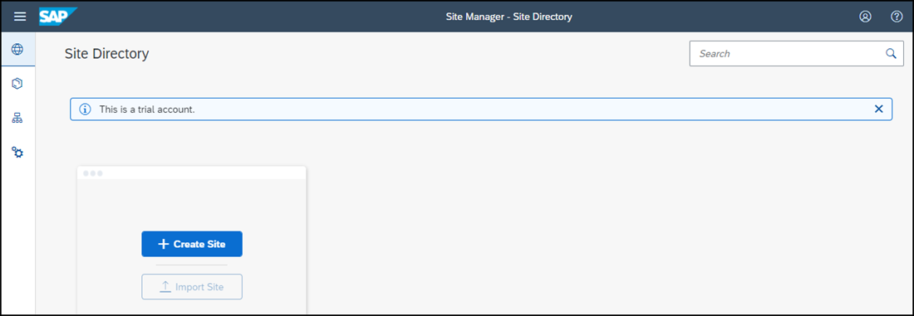

<h1>Prepare your Application and Launchpad Service</h1>
<p "text-align: left;">Here we describe steps on how you can add your HelloWorld application to an SAP Fiori Launchpad.<br />For more information, have a look at section <a href="https://help.sap.com/viewer/ad4b9f0b14b0458cad9bd27bf435637d/Cloud/en-US/3a0e6d6b791c4c2189f6a0a424188362.html" target="_blank" rel="noopener">Expose HTML5 Applications in Launchpad</a> on SAP Help Portal.&nbsp;<br /><br /><strong>Configure your HTML5 Application for the Launchpad&nbsp;</strong></p>
<p>To make your HTML5 applications visible to the Launchpad application, you have to check some information in the <strong>webapp/manifest.json</strong> file. This information was added by the <strong>Create Project from Template</strong> wizard, if you have chosen <strong>Yes</strong> to add <strong>Fiori Launchpad Configuration</strong> and <strong>Yes </strong>to <strong>Add to Managed Application Router</strong>.&nbsp;<br /><br />An HTML5 application you want to expose and integrate to the Launchpad must be deployed to the same subaccount as the Launchpad.</p>


1. Open the Workspace containing your HTML5 HelloWorld project in SAP Business Application Studio.</p>

2. Expand your HTML5 project and under the folder&nbsp;<strong>helloworldui5&nbsp;</strong>&gt;&nbsp;<strong>webapp</strong> open the <strong>manifest.json </strong>file<strong>.</strong>

3. To ensure that the data of the extension application is displayed correctly on the SAP Launchpad site, check the value of <strong>sap.cloud</strong> in <strong>webapp/manifest.json</strong> file.

```
"sap.cloud": {
        "public": true,
        "service": "sap-btp-helloworldui5"
    }
```

If you made any changes to your project, re-build and deploy the application as described in the previous step. If you did not make any changes just continue with the next step.&nbsp;


**Open Launchpad Site Manager**

1. Switch back to the <strong>subaccount</strong> in your SAP BTP Cockpit.

2. Navigate to <strong>Services</strong> &gt;&nbsp;<strong>Instances and Subscriptions</strong>&nbsp;in the left navigation pane.

3. Select the tab& <strong>Subscriptions</strong>, and choose <strong>Launchpad Service. </strong>The Launchpad Site Manager opens in a new window.
  
  

  

If you get the error message "Access Denied". Your user has not been assigned the role collection <strong>Launchpad_Admin</strong>. Go to <strong>Role Collections</strong>, click on <strong>Launchpad_Admin</strong> and assign the email address of your user (as described under step "Add yourself to the Launchpad Admin role").
  
